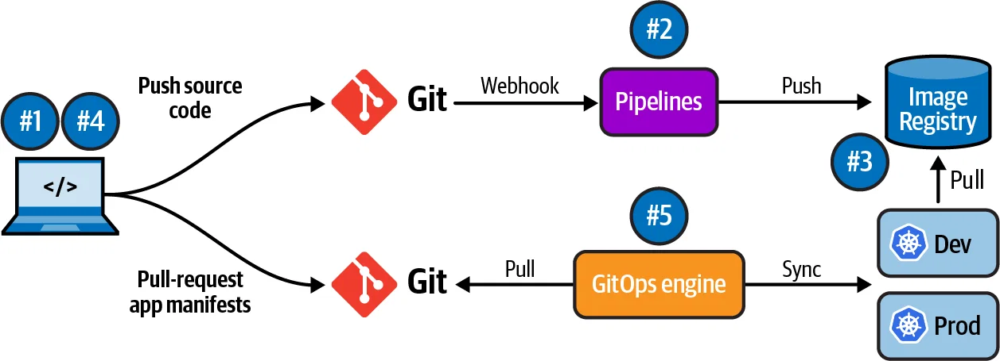

# Lời giải bài toán: Luồng Triển khai & Quản lý Cấu hình Multi-Environment

Tài liệu này trình bày giải pháp cho bài toán triển khai ứng dụng qua 4 môi trường (Dev, Test, Staging, Production), tập trung vào tính logic, khả năng tự động hóa và quản trị rủi ro.

### Sơ đồ Kiến trúc Tham khảo

Đây là sơ đồ tham khảo về luồng kiến trúc được đề xuất, minh họa luồng đi từ code của developer, qua CI/CD, đến GitOps repo và cuối cùng là các môi trường Kubernetes được quản lý bởi ArgoCD.

---

### I. Tổng quan Giải pháp: GitOps và Kustomize

Để giải quyết bài toán, chúng ta áp dụng nguyên tắc **GitOps** làm trọng tâm. Với GitOps, **Git repository là nguồn chân lý duy nhất (Single Source of Truth)** cho cả mã nguồn ứng dụng và cấu hình hạ tầng. Mọi thay đổi đều phải được thực hiện trên Git và được phê duyệt trước khi tự động áp dụng.

- **Công cụ chính:**
    - **Source Code & Config:** Tất cả được lưu trên Git.
    - **Quản lý cấu hình:** **Kustomize** được sử dụng để quản lý sự khác biệt về cấu hình giữa các môi trường từ một "base" chung.
    - **Tự động hóa (CI/CD):** **GitHub Actions** (hoặc một công cụ CI/CD tương tự) để build và test.
    - **Đồng bộ (CD):** Một agent như **ArgoCD** trong Kubernetes cluster sẽ theo dõi Git repository và tự động đồng bộ hóa trạng thái.

---

### II. Luồng triển khai từ Code mới đến Production

1.  **Phát triển & CI:**
    - Developer push code vào một nhánh `feature` trên repository ứng dụng.
    - Khi tạo Pull Request vào nhánh `main`, một quy trình **CI (Continuous Integration)** trên GitHub Actions được kích hoạt:
        - Chạy unit test, kiểm tra chất lượng code.
        - Build Docker image.
        - **Gắn thẻ (tag) image với mã Git commit SHA** (ví dụ: `myapp:abcdef1`). Đây là bước cốt lõi để đảm bảo kiểm soát phiên bản.
        - Push image đã được tag lên một Container Registry (như Docker Hub, ECR...).

2.  **Cập nhật Cấu hình & CD (Tới môi trường Dev):**
    - Sau khi CI thành công và Pull Request được merge vào `main`, một quy trình **CD (Continuous Deployment)** được kích hoạt.
    - GitHub Actions **tự động cập nhật file cấu hình** trong một Git repository khác (GitOps repo). Cụ thể, nó sẽ cập nhật tag của image trong file `kustomization.yaml` của môi trường `dev`.
    - **ArgoCD**, vốn đang theo dõi GitOps repo, sẽ phát hiện sự thay đổi này và tự động triển khai phiên bản image mới lên môi trường **Dev**.

3.  **Chuyển giao (Promote) lên Test/Staging:**
    - Sau khi phiên bản ở **Dev** đã được kiểm thử (tự động hoặc thủ công) và xác nhận ổn định, đội ngũ sẽ thực hiện "promote" phiên bản này.
    - **Hành động:** Tạo một Pull Request mới trong GitOps repo, **copy giá trị image tag** (chính là mã Git SHA đã được kiểm chứng) từ cấu hình của môi trường `dev` sang cấu hình của môi trường `test` hoặc `staging`.
    - **Điều kiện chuyển giao:** Pull Request này **phải được review và phê duyệt** bởi trưởng nhóm hoặc người có thẩm quyền.
    - Sau khi PR được merge, ArgoCD sẽ tự động cập nhật môi trường tương ứng.

4.  **Triển khai lên Production:**
    - Quy trình tương tự như chuyển lên Staging nhưng với mức độ kiểm soát cao hơn.
    - Một Pull Request để cập nhật image tag cho môi trường `prod` sẽ được tạo.
    - **Điều kiện:** PR này đòi hỏi phê duyệt từ nhiều bên hơn (ví dụ: Tech Lead, Product Owner), và chỉ được merge trong một khoảng thời gian cho phép (ví dụ: giờ hành chính). Đây chính là **"bước kiểm tra trước khi lên Production"**.
    - Merge PR sẽ kích hoạt ArgoCD triển khai phiên bản mới ra môi trường Production.

---

### III. Cách quản lý Branch, Phiên bản và Cấu hình

- **Quản lý Branch:**
    - **Repo ứng dụng:** Có thể dùng GitFlow (`develop`, `feature`, `release`, `main`) nhưng một mô hình đơn giản hơn là **Trunk-Based Development** (chỉ dùng `main` và các nhánh `feature` ngắn hạn) thường hiệu quả hơn với CI/CD hiện đại.
    - **Repo cấu hình (GitOps):** Chỉ cần một nhánh `main` duy nhất. **Không tạo nhánh theo môi trường** (`dev-branch`, `prod-branch`) vì nó sẽ gây phân mảnh và khó quản lý.

- **Quản lý Phiên bản:**
    - Phiên bản của ứng dụng được **kiểm soát tuyệt đối** thông qua **image tag là mã Git commit SHA**. Việc này đảm bảo mỗi phiên bản đang chạy có thể được truy vết ngược lại chính xác đến dòng code đã tạo ra nó.

- **Quản lý Cấu hình:**
    - Sử dụng **Kustomize** với cấu trúc `base` và `overlays`:
        - **`base`:** Chứa các file manifest Kubernetes chung nhất cho ứng dụng (deployment, service...). Đây là "khuôn mẫu" dùng cho mọi môi trường.
        - **`overlays/<tên-môi-trường>` (ví dụ: `overlays/dev`, `overlays/prod`):** Mỗi thư mục này chứa các file "vá" (patch) để tùy chỉnh cấu hình cho môi trường cụ thể đó. Ví dụ: `patch-replicas.yaml` để tăng số pod trong môi trường `prod`, hoặc `patch-env.yaml` để đặt các biến môi trường khác nhau.
    - **Lợi ích:** Cùng một "base", nhưng mỗi môi trường có "lớp áo" riêng. Dễ dàng thấy được sự khác biệt giữa các môi trường chỉ bằng cách xem các file patch trong overlays.

---

---

### IV. Cách xử lý khi triển khai lỗi (Rollback)

Khi một phiên bản mới trên Production gây lỗi, quy trình rollback trở nên cực kỳ nhanh chóng và an toàn nhờ GitOps.

- **Hành động:** Mở Git repository chứa cấu hình, tìm đến commit gây lỗi và thực hiện **`git revert`**.
- **Kết quả:** Thao tác này sẽ tạo ra một commit mới để hoàn tác lại thay đổi. ArgoCD sẽ phát hiện trạng thái trên Git đã quay về phiên bản ổn định trước đó và **ngay lập tức** tự động áp dụng lại cấu hình cũ này lên Kubernetes cluster. Ứng dụng sẽ được rollback về phiên bản cũ chỉ trong vài giây/phút.
- Lưu ý: Đối với các thay đổi liên quan đến cấu trúc cơ sở dữ liệu (Database Migration), kịch bản rollback cần đảm bảo nguyên tắc backward-compatibility (tương thích ngược) để mã nguồn cũ vẫn có thể chạy trên schema mới, hoặc phải có kịch bản chạy script hạ cấp database tương ứng.

---

### V. Các Rủi ro và Hướng Giảm thiểu

- **Rủi ro:** Một người nào đó `kubectl edit` trực tiếp trên cluster, gây sai lệch so với Git.
    - **Giảm thiểu:** Bật tính năng **self-heal** của ArgoCD để tự động hoàn tác mọi thay đổi thủ công. Phân quyền RBAC chặt chẽ, hạn chế tối đa quyền chỉnh sửa trực tiếp.

- **Rủi ro:** Lộ thông tin nhạy cảm (secrets) khi commit lên Git.
    - **Giảm thiểu:** **Tuyệt đối không commit secret dạng plain text.** Sử dụng các công cụ chuyên dụng như **Sealed Secrets** hoặc **HashiCorp Vault** để quản lý và inject secret một cách an toàn.

- **Rủi ro:** Cấu hình sai được merge vào `main`.
    - **Giảm thiểu:** Yêu cầu Pull Request và review bắt buộc. Tích hợp các công cụ `linter` (như `kubeval`) vào pipeline CI để tự động kiểm tra cú pháp của file manifest.

---

### VI. Minh họa Thực tế: Một hệ thống nhỏ đã được dựng sẵn

Để kiểm chứng và hiểu rõ hơn về kiến trúc này, một hệ thống nhỏ đã được dựng sẵn trong chính repository này tại thư mục `example-app-gitops`.

- **Cấu trúc:**
    - **`apps/src`**: Chứa mã nguồn của một ứng dụng web đơn giản.
    - **`apps/base`**: Chứa manifest Kubernetes cơ bản. (Lưu ý: Trong project ví dụ này, image tag được cập nhật trực tiếp tại đây cho sự đơn giản. Tuy nhiên, trong thực tế, việc cập nhật image tag nên được thực hiện trong `kustomization.yaml` của môi trường `dev` overlay để kiểm soát việc promote phiên bản.)
    - **`apps/overlays`**: Chứa các file Kustomize tùy chỉnh cho các môi trường `dev`, `test`, `staging`, `prod`.
    - **`.github/workflows`**: Chứa file `update-argocd-manifest.yaml` mô phỏng quy trình CI/CD cập nhật image tag vào cấu hình.

Hệ thống mẫu này chính là một bản thu nhỏ, thể hiện đầy đủ các nguyên tắc đã trình bày ở trên, cho thấy cách tổ chức source code và luồng triển khai thực tế hoạt động như thế nào.
